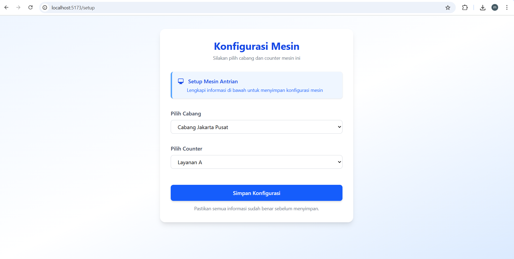
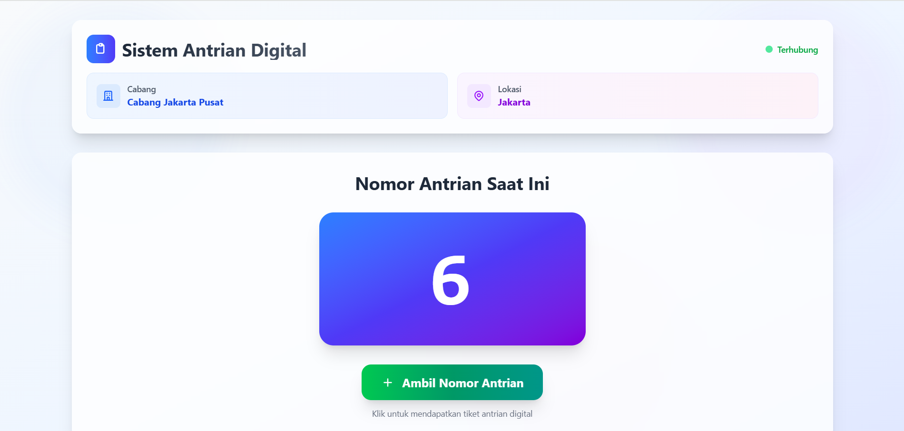
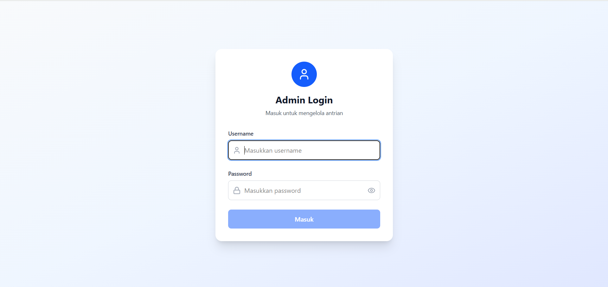
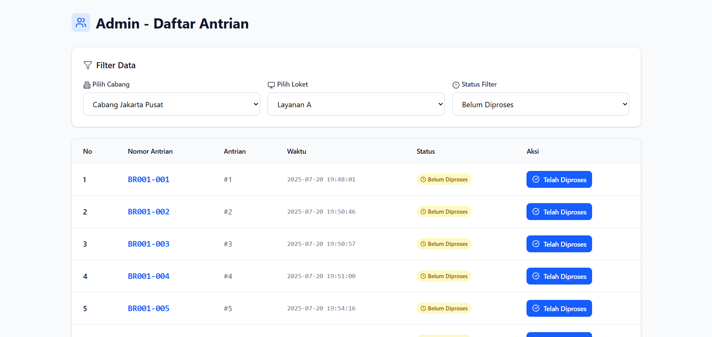

# 🖥️ Frontend Aplikasi Antrian Toko

Frontend aplikasi web untuk sistem antrian toko. Aplikasi ini dibuat menggunakan **React.js** dan **Tailwind CSS**, serta mendukung real-time update menggunakan **Socket.IO**.

## 🚀 Fitur

### 👥 Pelanggan

- Menampilkan nomor antrian terakhir
- Tombol **Masuk Antrian**
- Mendapatkan PDF antrian setelah masuk
- Real-time update saat antrian bertambah

### 🛠️ Petugas / Setup Mesin

- Memilih cabang & counter
- Menyimpan konfigurasi mesin lokal

### 👩‍💼 Admin

- Menampilkan daftar semua antrian
- Menandai antrian sebagai **Selesai**
- Mendukung pagination dan filter
- Real-time update saat antrian berubah

---

## ⚙️ Teknologi

- [React.js](https://reactjs.org/)
- [Tailwind CSS](https://tailwindcss.com/)
- [Socket.IO Client](https://socket.io/docs/v4/client-api/)
- [jsPDF](https://github.com/parallax/jsPDF) - untuk generate file PDF antrian
- [Axios](https://axios-http.com/) - untuk komunikasi dengan backend

---

## 🚀 Instalasi & Menjalankan Aplikasi

### 1. Clone Repository

```bash
git clone https://github.com/arioprima/pt-acset-frontend-test.git
cd pt-acset-frontend-test
```

### 2. Install Dependencies

Pastikan menggunakan Node.js versi 14 ke atas.

```bash
npm install
```

### 3. Konfigurasi Environment

Buat file `.env` di root folder dengan isi:

```env
VITE_API_BASE_URL=http://localhost:3000/api
```

### 4. Menjalankan Aplikasi

```bash
npm run dev
```

# 📘 Cara Menggunakan Aplikasi

### 1. 🛠️ Setup Mesin (Petugas)

- Buka halaman `http://localhost:5173/setup`
- Jika membuka `http://localhost:5173/` dan mesin belum disetel, sistem akan otomatis mengarahkan ke halaman setup
- Pilih **Cabang** dan **Counter** yang akan digunakan untuk mesin ini
- Klik tombol **Simpan**
- Setelah disimpan, mesin akan siap digunakan pelanggan untuk mengambil antrian di cabang & counter yang dipilih



### 2. 👥 Halaman Pelanggan

- Akses melalui `http://localhost:5173`
- Klik tombol **Masuk Antrian**
- Sistem akan otomatis mengambil nomor antrian terbaru untuk konfigurasi mesin saat ini
- File PDF akan otomatis terunduh berisi detail nomor antrian
- Nomor antrian juga akan ditampilkan di layar dan diperbarui secara real-time



### 3. 👩‍💼 Halaman Admin

- Akses melalui `http://localhost:5173/admin`
- Login menggunakan akun admin
- Tinjau daftar antrian dari semua cabang dan counter
- Klik tombol ✅ **Selesai** pada antrian yang telah diproses
- Daftar antrian akan diperbarui secara otomatis berkat integrasi Socket.IO





---
